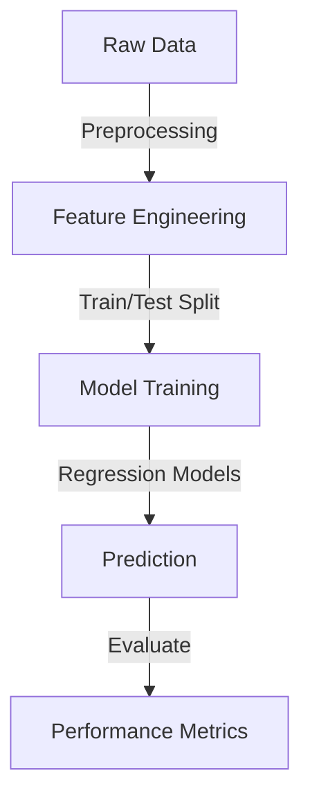

# 🏡 House Price Prediction

This repository contains a machine learning project for predicting house prices based on various features.

## 📌 Problem Statement
Predicting house prices accurately is crucial for buyers, sellers, and real estate professionals. This project aims to build a machine learning model that can estimate house prices based on various influencing factors.

## 💡 Concept
The project leverages regression techniques to predict house prices by analyzing historical data. The dataset includes various attributes like location, size, number of bedrooms, and other features that affect property valuation.

## 🏗️ Architecture



## ✨ Features
- **📍 Location-Based Pricing**: Understands the effect of locality on prices.
- **🏠 Property Attributes**: Number of rooms, size, and amenities.
- **📊 Market Trends**: Considers historical price trends.
- **📈 Advanced Regression Models**: Ridge, Lasso, and ElasticNet for better predictions.

## 🔍 Steps for Data Preparation and Analysis
1. **📂 Data Collection**: Load the dataset (`House Price Prediction Dataset.csv`).
2. **🛠️ Data Cleaning**: Handle missing values and inconsistencies.
3. **📉 Exploratory Data Analysis (EDA)**: Use visualization tools to understand trends.
4. **🧬 Feature Engineering**: Apply encoding and scaling techniques.
5. **✂️ Train-Test Split**: Divide data for training and evaluation.
6. **🤖 Model Training**: Train regression models to learn from the data.
7. **📏 Evaluation**: Measure model performance using Mean Squared Error (MSE).

## 🔧 Techniques Used
- **📜 Data Processing**: Pandas, Seaborn
- **⚙️ Feature Engineering**: One-hot Encoding, Standard Scaling
- **🧠 Model Training**: Ridge, Lasso, ElasticNet Regression
- **📊 Evaluation Metrics**: Mean Squared Error (MSE)

## 🛠️ Built With
- **🐍 Python** - Programming language
- **📦 Scikit-Learn** - Machine Learning framework
- **📊 Pandas** - Data analysis
- **📈 Matplotlib & Seaborn** - Data visualization
- **🧮 NumPy** - Numerical computing

## 📥 Installation
```bash
pip install -r requirements.txt
```
Additional steps:
1. Ensure Python 3.8+ is installed.
2. Install Jupyter Notebook for exploring the dataset.
3. Download and place `House Price Prediction Dataset.csv` in the project directory.

## 🚀 Usage
```python
python train.py
```

Additional usage options:
- Run `jupyter notebook` to explore and visualize the dataset.
- Modify `config.py` to adjust hyperparameters for training models.
- Use `python evaluate.py` to check model performance on test data.

## 📁 File Details
- `train.py` - Main script to train models.
- `evaluate.py` - Script for model evaluation.
- `config.py` - Contains model hyperparameters.
- `data/` - Directory storing the dataset.

## 📊 Results
The model's performance is evaluated using Mean Squared Error (MSE) to determine the accuracy of predictions.

## 👨‍💻 About the Developer
This project was developed by Pranaya as part of an effort to apply machine learning techniques to real-world problems. Contributions and suggestions are welcome!

## 🤝 Contributing
Feel free to contribute to this project by improving the models or adding new techniques.

## 📜 License
This project is open-source and available under the MIT License.


