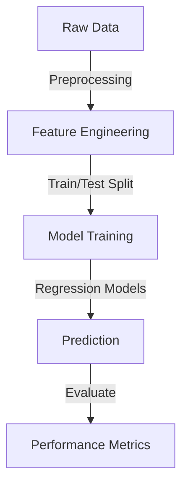

# House-price-prediction-model
# House Price Prediction

This repository contains a machine learning project for predicting house prices based on various features.

## Architecture




## Techniques Used
- **Data Processing**: Pandas, Seaborn
- **Feature Engineering**: One-hot Encoding, Standard Scaling
- **Model Training**: Ridge, Lasso, ElasticNet Regression
- **Evaluation Metrics**: Mean Squared Error (MSE)

## Installation
```bash
pip install -r requirements.txt
```
Additional steps:
1. Ensure Python 3.8+ is installed.
2. Install Jupyter Notebook for exploring the dataset.
3. Download and place `House Price Prediction Dataset.csv` in the project directory.

## Usage
```python
python train.py
```

Additional usage options:
- Run `jupyter notebook` to explore and visualize the dataset.
- Modify `config.py` to adjust hyperparameters for training models.
- Use `python evaluate.py` to check model performance on test data.

## Dataset
The dataset used in this project contains various features influencing house prices. The file is named `House Price Prediction Dataset.csv`.

## Results
The model's performance is evaluated using Mean Squared Error (MSE) to determine the accuracy of predictions.

## Contributing
Feel free to contribute to this project by improving the models or adding new techniques.

## License
This project is open-source and available under the MIT License.

